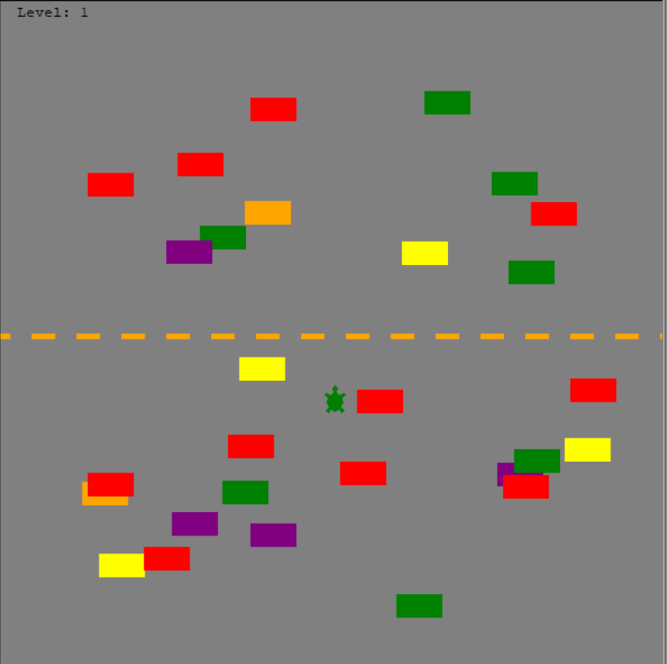

# Crossy Road (Python Turtle Edition)

A simple Crossy Road-inspired game built with Python's Turtle graphics module.

## Features

- Move your player (turtle) up the screen to avoid cars and reach new levels.
- Randomly generated cars in two lanes with increasing speed as you progress.
- Level tracking.
- Visual road divider for a classic arcade feel.
- Game over screen message when you collide with a car.

## Controls

- **Up Arrow**: Move the player forward.

## Requirements

- Python 3.12 or higher
- [turtle](https://docs.python.org/3/library/turtle.html) (usually included with Python)

## How to Run

1. clone the repository:

```sh
   git clone git@github.com:roshanbist/crossy-road-game.git
```

2. cd crossy-road-game.
3. Run the main script:

   ```sh
   python main.py
   ```

4. Use the Up Arrow key to move your player and avoid the cars!

## Project Structure

- [`main.py`](main.py): Game loop and main logic.
- [`player.py`](player.py): Player (turtle) implementation.
- [`car.py`](car.py): Car generation and movement logic.
- [`levelboard.py`](levelboard.py): Level display.
- [`roadDivider.py`](roadDivider.py): Visual divider for the road.

## Screenshots



## License

This project is for educational purposes.
